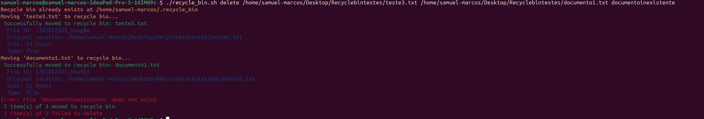
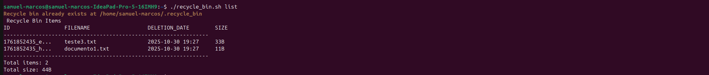
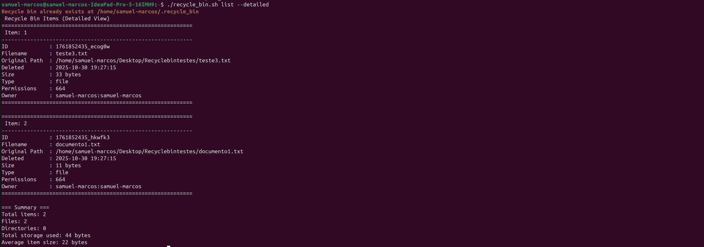
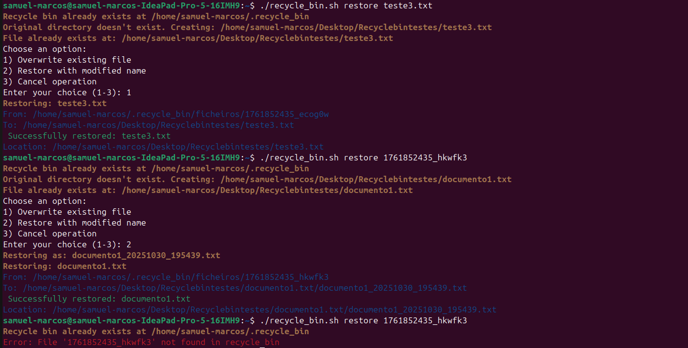
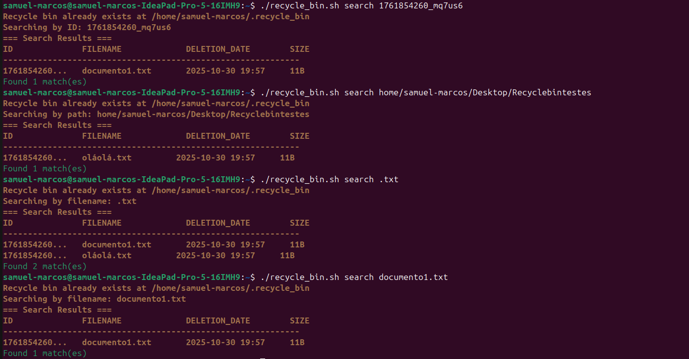
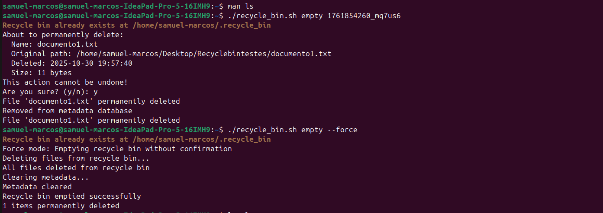
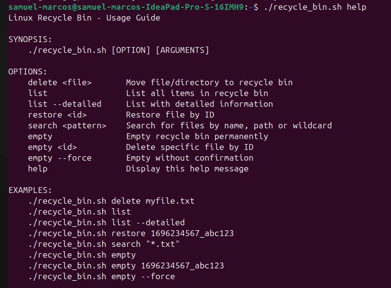

# Linux Recycle Bin System

## Author
Nome: Samuel Marcos Rocha Ramos
Nº Mecanográfico: 124955

## Description
[Brief project description]

## Installation
--> 1. Descarregar o script:
        -git clone (https://github.com/samuelmarcosramos/Projecto_SO.git) "\n"
        -cd StudentName_RecycleBin

--> 2. Tornar o script executável:
        chmod +x recycle_bin.sh

--> 3. (Opcional) Adicionar ao PATH para uso:
        sudo cp recycle_bin.sh /usr/local/bin/recycle_bin

## Usage
--> Sintaxe básica:
    ./recycle_bin.sh [COMMAND] [ARGUMENTS]

--> Ver ajuda completa:
    ./recycle_bin.sh help

## Features
    delete <file> - Move ficheiros/diretórios para a reciclagem

    list - Lista conteúdo da reciclagem (visão compacta)

    list --detailed - Lista com informação detalhada

    restore <id|filename> - Restaura ficheiros para localização original

    search <pattern> - Pesquisa por nome, caminho ou wildcards

    empty - Esvazia reciclagem permanentemente com confirmação

    empty <id> - Elimina permanentemente ficheiro específico por ID com confirmação

    empty --force - Esvazia sem confirmação a reciclegem permanentemente

    empty --force <id> - Elimina permanentemente o ficheiro específico por ID sem confirmação

    help - Mostra informação de utilização

## Configuration
--> O sistema configura-se automaticamente no primeiro uso. Ficheiros de configuração em ~/.recycle_bin/
    
    -Definições do sistema:
        MAX_SIZE_MB=1024        # Tamanho máximo da reciclagem (1GB)
        RETENTION_DAYS=30       # Dias de retenção antes de limpeza 
    
    -Estrutura de diretórios:
        ~/.recycle_bin/
        ├── ficheiros/          # Ficheiros eliminados (com IDs únicos)
        ├── metadata.db         # Base de dados CSV com metadados
        ├── log.txt            # Registo de operações
        └── config             # Configurações do sistema

## Examples
-->Inicialização:
    

-->Delete_File (Suporta múltiplos files de uma vez):
    

-->List:
    

-->List Detailed:
    

-->Restore:
    

-->Search:
    

-->Empty:
    

-->Help:
    

## Known Issues
    -Ficheiros com nomes muito longos são cortados no display

## References
 -Linux man pages
 -ShellCheck
 -PDFs do projecto
 -Chatgpt
